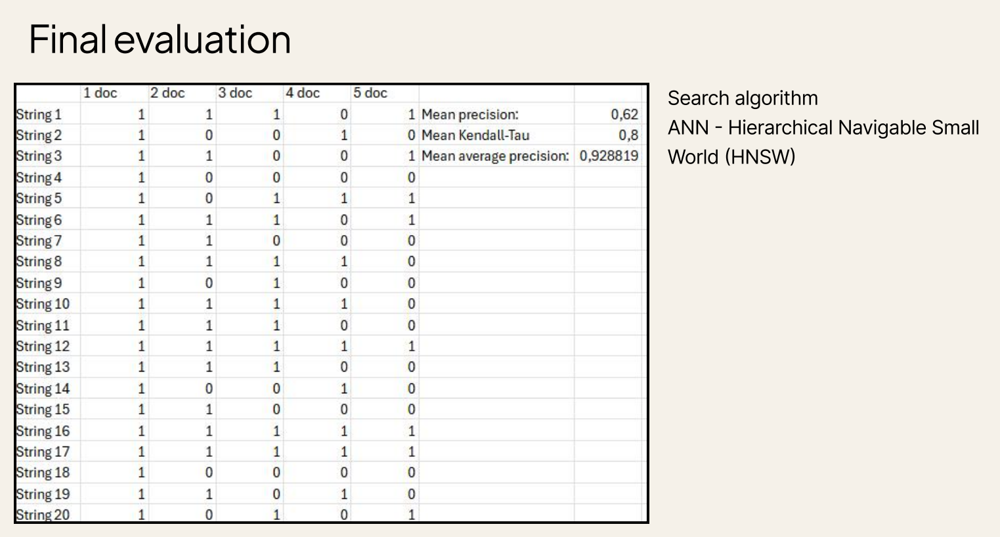
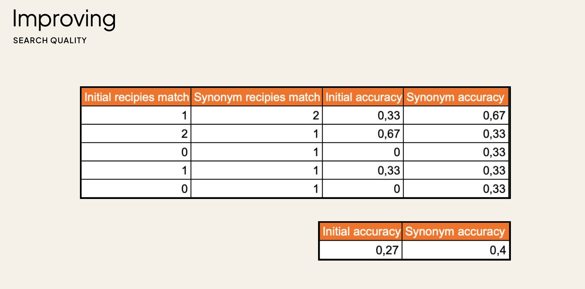

# Images2Recipes
Collaborative project, aimed to develop search application based on vector search. Our app is designed to help users to find recipes based on their ingredients and provide daily consultations for meal planning.

Block 1. Capture ingredient from the photo using MediaPipe. Form list of ingredients 

Block 2. Append list with synonyms using RusVectors. Form additional search string

#### Block 3. Part that is presented in the code and reflects my contribution to the project
Select an open-source dataset, slice it to 50 000 objects. Generate vectors for the database (Qdrant). Shrink the model. Test search algorithm

### Results in metrics.
0 and 1 represent relevance of the result

